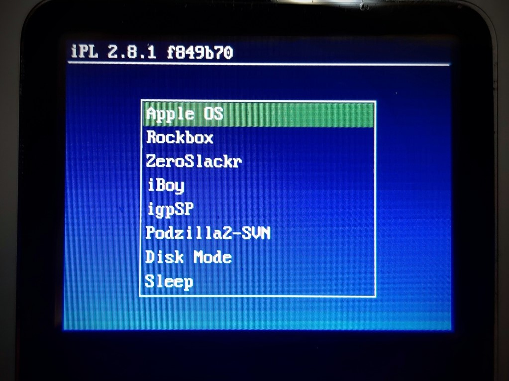

# iPodLoader 2

Multi-OS bootloader for PortalPlayer based classic iPods.

*The iPodLoader2 boot menu*

## Compatibility

iPodLoader 2 functions with the following iPod generations:

* 1st generation (mechanical spinning wheel, buttons surround wheel, firewire port)
* 2nd generation (touch wheel, buttons surround wheel, firewire port, appears very similar to 1st generation)
* 3rd generation (touch wheel, four touch buttons under display, first iPod with 30 pin dock connector)
* 4th generation monochrome (click wheel)
* 4th generation colour ("iPod Photo" a.k.a "iPod with color display")
* 5th / 5.5th generation (Video, "iPod with Video")
* mini 1st generation (dated 2004, all 4GB capacity, no HDD capacity engraving on the rear)
* mini 2nd generation (dated 2005, 4GB and 6GB models, HDD capacity engraved on the rear)
* nano 1st generation (while/black gloss)
* nano 2nd generation (colourful with rounded edges, looks like a tiny iPod mini)

iPodLoader 2 can boot the following operating systems:

* iPod OS (stock Apple firmware)
* Rockbox
* iPod Linux
* It can also boot into firmware disk mode, or put the iPod back to sleep.

## Bootloader installation

See [INSTALL](docs/INSTALL.md) for detailed iPodLoader2 installation instructions.

## Installing iPod Linux

See [IPOD_LINUX_INSTALL](docs/IPOD_LINUX_INSTALL.md) for up to date iPod Linux installation instructions.

The ZeroSlackr distribution includes very fast emulators such as iBoy (GB/GBC) and igpSP (GBA), so if you want to use the iPod for emulating games, go here!

## Installing Rockbox

See [ROCKBOX_INSTALL](docs/ROCKBOX_INSTALL.md) for Rockbox installation instructions.

## Building iPodLoader2

See [BUILDING](docs/BUILDING.md) for detailed build instructions, for if you want to build iPodLoader2 from source.

## Overview

Loader2 & iPodPatcher / SansaPatcher

- This is the main bootloader for iPodLinux. It is capable
  of loading both the iPodLinux kernel and the original
  Apple OS as well as Rockbox. It is installed via Rockbox's
  ipodpatcher tool.
- Loader2 can be configured and customized. See the
  "loader.cfg" file.
- Rockbox can also be installed by extracting the latest
  Rockbox build directly to the iPod and editing the
  "loader.cfg" file.
- SansaLinux version uses pre-built sansapatcher files
  that are patched to load SansaLinux. The files currently
  used are from the original SansaLinux release. Much of
  the below information does not apply.
  For more information, see:
- http://ipodlinux.org/wiki/Loader2
- http://www.rockbox.org/twiki/bin/view/Main/IpodPatcher
- http://en.wikipedia.org/wiki/Bootloader

## Usage

- Since Loader2 is a bootloader written from scratch,
  it has its own special syntax.
- For proper usage of Loader2 and its various options/syntax,
  see the provided "loader.cfg" file as well as
  the iPodLinux wiki page: http://ipodlinux.org/wiki/Loader2
- The iPodLinux kernel accepts most standard kernel arguments;
  see "/docs/kernel/Original/kernel-parameters.txt"
- Loader2 has also been patched to play a boot tune on startup.
  The default boot tune should be familiar to Final Fantasy
  gamers ; )

## Attribution

- Authors: iPL Core Devs
- Original SVN source link:
  https://ipodlinux.svn.sourceforge.net/svnroot/ipodlinux/apps/ipod/ipodloader2
- Date: Oct 31, 2008
- Version: Revision 2445
- See commit authors for modifications performed since the SVN revision was imported.

### License

Unless otherwise stated, all source code is licensed under
GNU GPL - see License.txt. For the licensing of the
software/application, refer to the license that comes
with the original/ported software.
