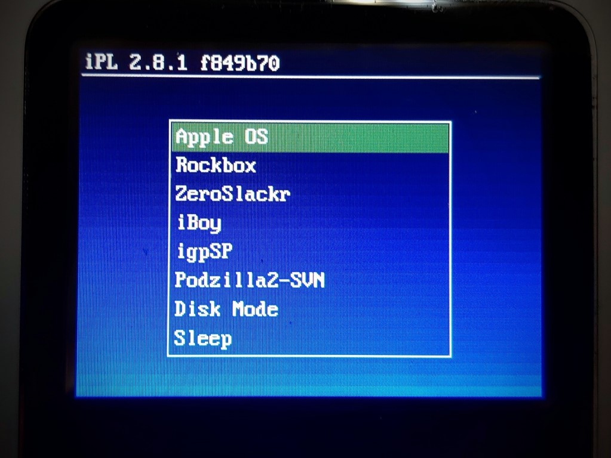

# Install Loader 2

Installation requires `loader.bin`, which is the compiled bootloader blob. The latest version can be found under [releases](https://github.com/crozone/ipodloader2/releases). There are also instructions for building from source.

This will be installed using [iPodPatcher](https://www.rockbox.org/wiki/IpodPatcher).

## Install steps

### Get ipodpatcher

iPod patcher can be found at the [Rockbox website here](https://www.rockbox.org/wiki/IpodPatcher).

#### Find the drive index of the ipod.
Run `ipodpatcher -l`

If ipodpatcher found an iPod, it will print something like "Ipod found - 2nd Generation Mini ("winpod") - disk device 2"
Remember the disk device number.

#### Backup the original boot partition
Run `ipodpatcher <device> -r original_boot_partition.bin`

where `<device>` is the iPod device number (eg. 2)

This backs up the firmware partition to `original_boot_partition.bin`

This backup can be used to quickly revert the firmware partition without having to wipe the iPod. If you lose this backup, the iPod can always be returned to factory condition by simply restoring it in iTunes.

#### Bootloader installation

Patch in the bootloader directly onto the iPod:

Run `ipodpatcher <device> -ab loader.bin`

Example output from installing on an iPod Video 5.5G:

```
$ ./ipodpatcher -ab "loader_2.8.1_release.bin"
ipodpatcher 5.0 with v4.0 bootloaders (v1.0 for 2nd Gen Nano)
(C) Dave Chapman 2006-2009
This is free software; see the source for copying conditions.  There is NO
warranty; not even for MERCHANTABILITY or FITNESS FOR A PARTICULAR PURPOSE.

[INFO] Scanning disk devices...
[INFO] Read XML info (9692 bytes)
[INFO] Ipod found - Video (aka 5th Generation) ("winpod") - disk device 2
[INFO] Reading partition table from \\.\PhysicalDrive2
[INFO] Sector size is 2048 bytes
[INFO] Part    Start Sector    End Sector   Size (MB)   Type
[INFO]    0              63         64259       125.4   Empty (0x00)
[INFO]    1           64260     249935870    488030.5   W95 FAT32 (0x0b)
[INFO] Read XML info (9692 bytes)
[INFO] Ipod model: Video (aka 5th Generation) (64MB RAM) ("winpod")
[INFO] Moving images to create room for new firmware...
[INFO] Reading original firmware...
[INFO]  Wrote 7618560 bytes to firmware partition
[INFO] Bootloader .\loader builds\loader_2.8.1_release.bin written to device.
```

#### If anything goes wrong

Put the iPod into forced disk mode by first resetting it (Menu + Select for 6 seconds) and then immediately holding down the disk mode key combo (Play/Pause + Select) until disk mode appears.

Revert to firmware backup:

Run `ipodpatcher <device> -w original_boot_partition.bin`

If this doesn't work, use iTunes to restore the iPod to reset it to factory condition.

### Create loader.conf

Create a file called `loader.conf` in the root of the FAT32 partition.

An example `loader.cfg` example is included in the repo.

Loader2 will load this configuration at boot. It contains the boot menu items.

Here is a basic example config:

```
# iPod Loader 2 configuration file
backlight = 1
timeout = 5
default = 1
disable_boot_tune=1

# Menu choices:
Apple OS @ ramimg
Rockbox @ (hd0,1)/.rockbox/rockbox.ipod
Disk Mode @ diskmode
Sleep @ standby
```

### Test

Eject the iPod. The iPod should detect that its firmware has been updated, and reboot on its own. If it does not, reboot it by holding down Menu + Select for 6 seconds.

The iPodLoader2 boot menu should be presented and allow you to select an operating system.

Go and boot some stuff!


*The iPodLoader2 boot menu*
