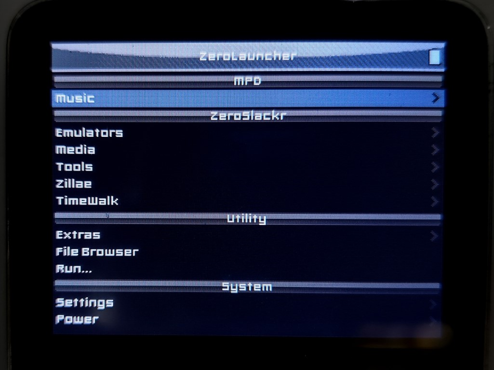

# iPod Linux

iPodLinux is a &#0181;Clinux-based Linux distribution designed specifically to run on iPod. It allows Linux applications to be ported and run on the iPod with minimal code modifications.


The ported applications include several high quality console emulators, such as iBoy (GB/GBC) and igpSP (GBA). These are significantly faster than their Rockbox counterparts, making iPod Linux an attractive choice for emulation.

## The old installation method

The original, hard way to install iPod Linux involves partitioning the iPod to add a Linux ext2/ext3 partition to the drive, and then installing iPod Linux onto that. This is very difficult to do correctly because partitioning tools see the firmware partition as "unpartitioned free space", and will often corrupt the iPod firmware.

There is also the official iPod Linux installer, which is referenced by many old how-to guides. The iPod Linux installer attempts to partition the iPod for you and copy the necessary files to the new partition, as well as install a basic bootloader. However, the installer is very old, requires raw disk access on the iPod, and does not work correctly with modern versions of Windows. I do not recommend the use of the official iPod Linux installer. There are better ways to install iPod Linux today.

## Project Zeroslackr

[Project ZeroSlackr](https://github.com/ProjectZeroSlackr/ProjectZeroSlackr-SVN) is a modified distribution of iPod Linux designed to be entirely "drag and drop". It avoids the need to repartition the iPod. It accomplishes this by storing iPod Linux's root ext2 filesystem inside a file stored on the data partition. iPod Linux loopmounts this file as the root fs during boot.

This document will cover the installation of Project ZeroSlackr.

### Installation

#### Prepare the iPod

In iTunes, enable Disk Mode on the iPod. The iPod data partition should be mounted and accessible through explorer.

**NOTE:** HFS+ formatted MacPods are untested and not recommended. At minimum, MacPods must be reformatted to HFS+ with journaling disabled, which is not covered by this guide. For a smooth experience, format the iPod as a WinPod using iTunes on Windows, so that it has a FAT32 data partition. WinPods can still be used on macOS, but MacPods cannot be used on Windows.
#### Install iPodLoader2

Install iPodLoader2 if you have not already done so. See [INSTALL](INSTALL.md) for details.

#### Sourcing the installation files

Download the latest version of [Project ZeroSlackr from the SourceForge repo here](https://sourceforge.net/projects/zeroslackr/). At the time of writing, this is `ZeroSlackr-SVN-snapshot-2008-08-11.7z`. This distribution includes many pre-installed applications, such as iBoy (Gameboy emulator) and igpSP (GBA emulator). More lightweight installs with less pre-installed applications are available from [here](https://sourceforge.net/projects/zeroslackr/files/Pre-Releases/ZeroSlackr%20SVN%20snapshot%202008-08-11/).

Extract the 7zip archive to your computer.

#### Copy files to the iPod

Copy the following directories from the archive to the root of the iPod:

* /etc/
* /ZeroSlackr/
* /bin/
* /boot/
* /dev/

#### Setup `loader.cfg`

iPodLoader2 needs a bootloader entry to tell it how to boot Project ZeroSlackr. Create or edit `loader.cfg` in the root of the iPod, and add the line:

`ZeroSlackr @ (hd0,1)/boot/vmlinux root=/dev/hda2 rootfstype=vfat rw quiet`

Additional entries can be created to boot directly into a target application, by using the `autoexec` kernel argument.

Refer to the reference copy of `loader2.cfg` included in the archive.

##### loader2.cfg example:

```
ZeroSlackr @ (hd0,1)/boot/vmlinux root=/dev/hda2 rootfstype=vfat rw quiet
iBoy @ (hd0,1)/boot/vmlinux root=/dev/hda2 rootfstype=vfat rw quiet autoexec=/opt/Emulators/iBoy/Launch/Launch.sh
igpSP @ (hd0,1)/boot/vmlinux root=/dev/hda2 rootfstype=vfat rw quiet autoexec=/opt/Emulators/igpSP/Launch/Launch-no-sound.sh
#Encyclopodia @ (hd0,1)/boot/vmlinux root=/dev/hda2 rootfstype=vfat rw quiet autoexec=/opt/Tools/Encyclopodia/Launch/Launch.sh
Podzilla2-SVN @ (hd0,1)/boot/vmlinux root=/dev/hda2 rootfstype=vfat rw quiet autoexec=/opt/Zillae/Podzilla2-SVN/Launch/Launch.sh
```
#### Test

Eject the iPod and reboot it.

iPodLoader2 should boot. Select ZeroSlackr from the boot menu.
iPod Linux should boot into the ZeroLauncher interface.


*Project ZeroSlackr's ZeroLauncher home screen*

By default, ZeroLauncher is the first application that is run after boot. It is a modified version of Podzilla2, which is a menu based browser for launching other applications. To change the first boot application, add an `autoexec=` argument to the loader2.cfg entry.

All done. Go say hello to Tux!

### FAQ

#### Q: How do I get emulators on iPod Linux? Where do I put my ROMs?

Project ZeroSlackr already comes installed with several emulators:

* iAtari800
* iBoy
* iDarcNES
* iGameGear
* igpSP
* iPodMAME

On the iPod data partition these are located in `/ZeroSlackr/opt/Emulators` and get mounted under `/opt/Emulators` within iPod Linux. They are accessible through the ZeroLauncher interface, however they can also be booted directly from iPodLoader2 by launching their launch script from the `autoexec=` argument. This increases the free memory availabe to the emulator by skipping ZeroLauncher entirely.

##### Example loader.cfg entries for iBoy and igpSP:
```
iBoy @ (hd0,1)/boot/vmlinux root=/dev/hda2 rootfstype=vfat rw quiet autoexec=/opt/Emulators/iBoy/Launch/Launch.sh
igpSP @ (hd0,1)/boot/vmlinux root=/dev/hda2 rootfstype=vfat rw quiet autoexec=/opt/Emulators/igpSP/Launch/Launch-no-sound.sh
```

ROMs should be placed under `/ZeroSlackr/opt/Emulators/<emulator>/Roms`. Save games will be saved under `/ZeroSlackr/opt/Emulators/<emulator>/Saves`.

#### Q: Why do I keep running out of memory?

Out of memory errors are usually caused by memory fragmentation.
Even though there may technically be enough free memory available, there isn't a large enough block of contiguous free memory for the application to allocate memory.

Classic iPods only have 32mb or 64mb of RAM, and their CPUs lack an MMU capable of implementing virtual memory.
This means that all applications run in the same address space, cannot be swapped, and the memory cannot be defragmented/compacted.
This makes iPods especially susceptible to memory fragmentation.

To avoid memory fragmentation issues, boot demanding applications directly from iPodLoader2 using a dedicated boot menu entry and the `autoexec=` argument.
See above for an example.
This bypasses ZeroLauncher and reduces memory usage before the application is first started.

#### Q: Why can't iPod Linux be directly installed onto a FAT32 (WinPod) partition?

You may wonder if iPod Linux can be installed by simply by extracting the root filesystem onto the iPod's data partition, and then booting the kernel with the right `root` argument. Unfortunately, FAT32 doesn't support the file permissions and symbolic link features required for Linux to work. I actually attempted to get this working as a proof of concept with lots and lots of hacks, but I couldn't even get it to finish booting up.

This is why iPod Linux needs to be booted off an ext2 partition. Luckily, this partition doesn't need to be a physical partion on the iPod hard drive. The ZeroSlackr modified linux kernel can boot from an ext2 image file, which can be stored within the FAT32 partition.

#### Q: Why can't iPod Linux be direclty installed onto a HFS+ (MacPod) partition?

HFS+ theoretically supports all the features required for iPod Linux to boot and run (after all, macOS is a Unix-like operating system, and can boot from HFS+). I haven't tested it, but it's probably possible to get this working.

Journal support must be disabled on the iPod HFS+ partion, or iPod Linux will mount it as read-only. This is true whether the ext2 loopmount image is used, or the partition is used directly. By default, macOS+iTunes format the iPod to HFS+ *with journaling enabled*, so it must be manually reformatted to *journaling disabled* to use HFS+ with any flavour of iPod Linux.
