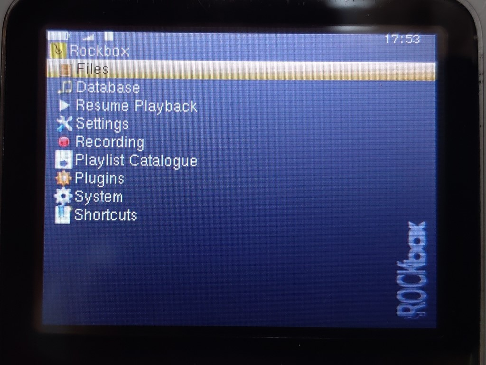

# Rockbox

[Rockbox](https://www.rockbox.org/) is a free, open source jukebox firmware for digital music players. It is available for many PortalPlayer based devices, including classic iPods (iPod 1g through 6g (Classic), iPod Mini, iPod Nano 1g, iPod Nano 2g).

## Installation

### Install iPodLoader2

Install iPodLoader2 if you have not already done so. See [INSTALL](INSTALL.md) for details.

### Get Rockbox

Download the correct Rockbox Firmware archive from the [Rockbox website](https://www.rockbox.org/download/byhand.cgi).

Extract the archive.

### Install files

Copy the extracted `.rockbox` directory to the root of the iPod.

### Add `loader.cfg` entry

Ensure that the Rockbox boot menu entry is included in loader.cfg:

`Rockbox @ (hd0,1)/.rockbox/rockbox.ipod`

### Done

Eject the iPod and reboot.

Select Rockbox from the boot menu. You should be presented with the Rockbox homescreen.

Rock on!

*The Rockbox home menu*
